# Introduction to IRT Using R (2PL)
Wan Nor Arifin  
January 22, 2017  

<script type="text/javascript" async src="https://cdn.mathjax.org/mathjax/latest/MathJax.js?config=TeX-MML-AM_CHTML">
</script>

# Introduction
Our focus is on 2PL model only. The formula is given as:

$$P(\theta) = { 1\over{1+e^{-a(\theta-b)}} }$$

1PL (Rasch), 3PL & 4PL have to learn on your own.

A short introduction and comparison between item analysis and item response theory analysis is presented in Arifin and Yusoff (2017).

# Preliminary readings
- "The Basics of Item Response Theory" by Frank B. Baker, http://echo.edres.org:8080/irt/baker/final.pdf
- "Applying item response theory (IRT) modeling to questionnaire development, evaluation, and refinement", https://www.researchgate.net/profile/Maria_Edelen/publication/6432794_Applying_item_response_theory_(IRT)_modeling_to_questionnaire_development_evaluation_and_refinement/links/09e415092a186a0ccb000000.pdf
- "Item Response Theory approaches to test scoring and evaluating the score accuracy" by Anna Brown, https://kar.kent.ac.uk/44777/1/Brown%20-%20IRT%20Test%20Scoring%20-%202nd%20revision%20-%20Accepted.pdf

# Important cutoff values
## Discrimination:
- De Ayala (2008, pg. 101): Good .8 to 2.5
- Baker (2001, pg. 35): 0: None, .01 to .34: Very low, .35 to .64: Low, .65 to 1.34: Moderate, 1.35 to 1.69: High, > 1.70: Very high, + infinity: Perfect
- Hambleton (1991, pg. 15): Usual range 0 to 2

## Difficulty:
- De Ayala (2008, pg. 15: Theoretical range -inf to + inf; typical range -3 to +3; < -2.0: Easy; -2.0 to 2.0: Average, > 2.0: Hard
- Hambleton (1991, pg. 13): -2 (very easy) to +2 (very difficult)
- Baker (2001, pg. 32-33): Theoretical range -4 to +4, typical range -3 to +3, usual range -2.8 to + 2.8

# Practical session

## Install packages

```r
install.packages(c("psych", "ltm", "irtoys", "mirt", "latticeExtra"))
```
## Load required libraries

```r
library("psych")
library("ltm")
library("irtoys")
library("mirt")
library("latticeExtra")
```

## Load data
Read data set "mtf.csv" into "data.mtf" data frame

```r
data.mtf = read.csv("mtf.csv", header = TRUE)  # Includes headers
head(data.mtf)  # View first 6 students in the data set
```

```
##   Q1A Q1B Q1C Q1D Q1E Q2A Q2B Q2C Q2D Q2E
## 1   1   0   0   0   0   0   1   1   0   0
## 2   1   0   0   0   1   0   0   1   1   1
## 3   0   1   0   0   1   1   0   1   1   0
## 4   1   1   0   1   1   0   1   0   1   1
## 5   1   1   1   0   1   1   1   1   1   0
## 6   0   1   1   1   1   0   1   1   1   1
```

```r
names(data.mtf)  # List down variables in the data set
```

```
##  [1] "Q1A" "Q1B" "Q1C" "Q1D" "Q1E" "Q2A" "Q2B" "Q2C" "Q2D" "Q2E"
```

```r
dim(data.mtf)  # Data set consists of 10 variables and 160 students
```

```
## [1] 160  10
```

## Descriptive statistics
Percentages of correct answers (1) by questions

```r
response.frequencies(data.mtf)
```

```
##           0       1 miss
## Q1A 0.30625 0.69375    0
## Q1B 0.25625 0.74375    0
## Q1C 0.37500 0.62500    0
## Q1D 0.40625 0.59375    0
## Q1E 0.16250 0.83750    0
## Q2A 0.25000 0.75000    0
## Q2B 0.26875 0.73125    0
## Q2C 0.34375 0.65625    0
## Q2D 0.47500 0.52500    0
## Q2E 0.48125 0.51875    0
```

## IRT analysis, 2-PL model
### Perform analysis by `ltm`

```r
# Basic statistics using ltm, focus on percentages of correct answers (1) by questions
descript(data.mtf)
```

```
## 
## Descriptive statistics for the 'data.mtf' data-set
## 
## Sample:
##  10 items and 160 sample units; 0 missing values
## 
## Proportions for each level of response:
##          0      1  logit
## Q1A 0.3062 0.6938 0.8177
## Q1B 0.2562 0.7438 1.0656
## Q1C 0.3750 0.6250 0.5108
## Q1D 0.4062 0.5938 0.3795
## Q1E 0.1625 0.8375 1.6397
## Q2A 0.2500 0.7500 1.0986
## Q2B 0.2688 0.7312 1.0010
## Q2C 0.3438 0.6562 0.6466
## Q2D 0.4750 0.5250 0.1001
## Q2E 0.4812 0.5188 0.0750
## 
## 
## Frequencies of total scores:
##      0 1 2 3 4  5  6  7  8  9 10
## Freq 2 1 1 7 6 19 38 31 27 16 12
## 
## 
## Point Biserial correlation with Total Score:
##     Included Excluded
## Q1A   0.4259   0.2084
## Q1B   0.3381   0.1236
## Q1C   0.5585   0.3539
## Q1D   0.4177   0.1832
## Q1E   0.3819   0.2068
## Q2A   0.3798   0.1712
## Q2B   0.3497   0.1327
## Q2C   0.4403   0.2175
## Q2D   0.4895   0.2623
## Q2E   0.4619   0.2296
## 
## 
## Cronbach's alpha:
##                value
## All Items     0.5033
## Excluding Q1A 0.4772
## Excluding Q1B 0.5018
## Excluding Q1C 0.4277
## Excluding Q1D 0.4857
## Excluding Q1E 0.4791
## Excluding Q2A 0.4881
## Excluding Q2B 0.4995
## Excluding Q2C 0.4743
## Excluding Q2D 0.4589
## Excluding Q2E 0.4702
## 
## 
## Pairwise Associations:
##    Item i Item j p.value
## 1       3      5   1.000
## 2       6      8   1.000
## 3       2     10   1.000
## 4       4      5   0.978
## 5       2      3   0.963
## 6       7     10   0.945
## 7       6      7   0.918
## 8       1      4   0.836
## 9       1      5   0.803
## 10      5      8   0.800
```

```r
# Perform the analysis with ltm(), and save the results in "irt.mtf"
irt.mtf = ltm(data.mtf ~ z1, IRT.param = TRUE)
coef(irt.mtf)  # Obtain difficulty and discrimination parameter estimates
```

```
##          Dffclt    Dscrmn
## Q1A -1.34813444 0.6637809
## Q1B -4.20384339 0.2572201
## Q1C -0.40398852 2.0871272
## Q1D -0.53216018 0.8114138
## Q1E -3.96868564 0.4283655
## Q2A -2.64619595 0.4320399
## Q2B -2.05447180 0.5154989
## Q2C -1.06267344 0.6670853
## Q2D -0.13935513 0.8074819
## Q2E -0.09428061 0.9122159
```

```r
summary(irt.mtf)  # Obtain LL, SE & z.vals
```

```
## 
## Call:
## ltm(formula = data.mtf ~ z1, IRT.param = TRUE)
## 
## Model Summary:
##   log.Lik      AIC      BIC
##  -956.738 1953.476 2014.979
## 
## Coefficients:
##              value std.err  z.vals
## Dffclt.Q1A -1.3481  0.5674 -2.3758
## Dffclt.Q1B -4.2038  4.1223 -1.0198
## Dffclt.Q1C -0.4040  0.1527 -2.6457
## Dffclt.Q1D -0.5322  0.2748 -1.9362
## Dffclt.Q1E -3.9687  2.8787 -1.3786
## Dffclt.Q2A -2.6462  1.6249 -1.6285
## Dffclt.Q2B -2.0545  1.0384 -1.9785
## Dffclt.Q2C -1.0627  0.4600 -2.3101
## Dffclt.Q2D -0.1394  0.2281 -0.6108
## Dffclt.Q2E -0.0943  0.2059 -0.4578
## Dscrmn.Q1A  0.6638  0.2876  2.3077
## Dscrmn.Q1B  0.2572  0.2558  1.0055
## Dscrmn.Q1C  2.0871  0.9927  2.1025
## Dscrmn.Q1D  0.8114  0.3007  2.6980
## Dscrmn.Q1E  0.4284  0.3284  1.3045
## Dscrmn.Q2A  0.4320  0.2762  1.5640
## Dscrmn.Q2B  0.5155  0.2721  1.8949
## Dscrmn.Q2C  0.6671  0.2762  2.4148
## Dscrmn.Q2D  0.8075  0.3078  2.6232
## Dscrmn.Q2E  0.9122  0.3166  2.8810
## 
## Integration:
## method: Gauss-Hermite
## quadrature points: 21 
## 
## Optimization:
## Convergence: 0 
## max(|grad|): 0.0083 
## quasi-Newton: BFGS
```

```r
plot(irt.mtf, type = "ICC", legend = TRUE)  # Item Characteristic Curves
```

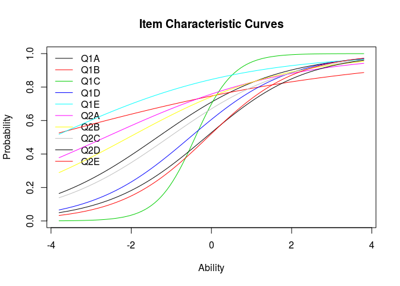<!-- -->

```r
plot(irt.mtf, type = "ICC", legend = TRUE, items=3) # Q1c
```

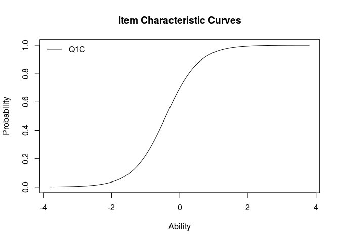<!-- -->

```r
plot(irt.mtf, type = "IIC", legend = TRUE)  # Item Information Curves
```

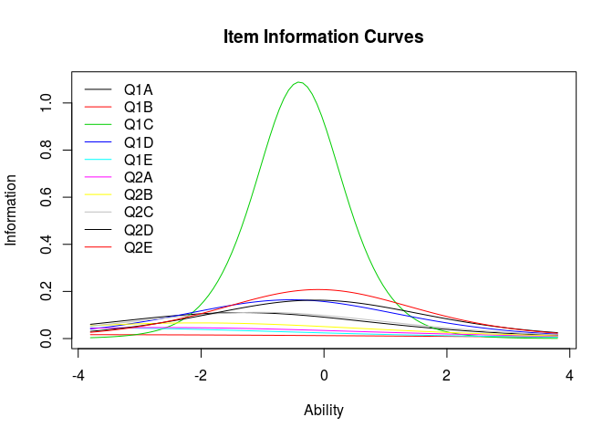<!-- -->

```r
# or Item Information Function
plot(irt.mtf, type = "IIC", legend = TRUE, items=3) # Q1c
```

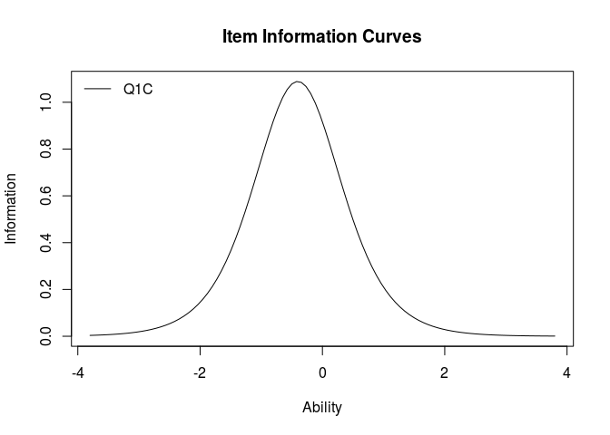<!-- -->

```r
plot(irt.mtf, items = 0, type = "IIC")  # Test Information Function
```

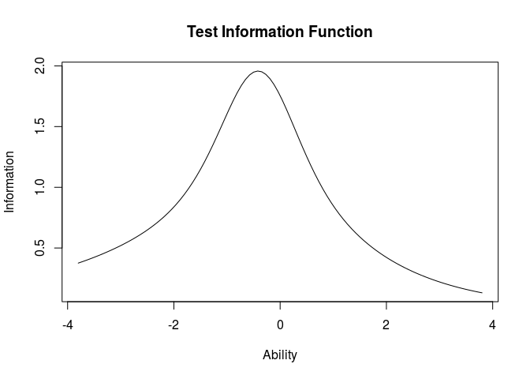<!-- -->

```r
information(irt.mtf, c(-3,3))  # Test information between -3 to +3 ability range
```

```
## 
## Call:
## ltm(formula = data.mtf ~ z1, IRT.param = TRUE)
## 
## Total Information = 7.46
## Information in (-3, 3) = 5.87 (78.7%)
## Based on all the items
```

```r
# "irtoys" package
plot(trf(est(data.mtf, model = "2PL", engine = "ltm")))  #Test Characteristic Curve
```

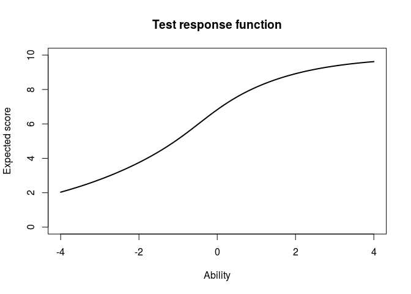<!-- -->

```r
# or Test Response Function
# Item fit
item.fit(irt.mtf)  # df = 10-2 = 8
```

```
## 
## Item-Fit Statistics and P-values
## 
## Call:
## ltm(formula = data.mtf ~ z1, IRT.param = TRUE)
## 
## Alternative: Items do not fit the model
## Ability Categories: 10
## 
##         X^2 Pr(>X^2)
## Q1A 14.3105    0.074
## Q1B 24.0446   0.0023
## Q1C 33.1838   0.0001
## Q1D 14.9949   0.0592
## Q1E 12.8225   0.1181
## Q2A 16.4653   0.0362
## Q2B 19.8424   0.0109
## Q2C 15.9399   0.0432
## Q2D 15.8849   0.0441
## Q2E 15.2307   0.0548
```

```r
# Fit for margins
margins(irt.mtf)
```

```
## 
## Call:
## ltm(formula = data.mtf ~ z1, IRT.param = TRUE)
## 
## Fit on the Two-Way Margins
## 
## Response: (0,0)
##   Item i Item j Obs   Exp (O-E)^2/E    
## 1      5      6  14  7.24      6.32 ***
## 2      2      5  13  7.11      4.87 ***
## 3      4      7  15 20.18      1.33    
## 
## Response: (1,0)
##   Item i Item j Obs   Exp (O-E)^2/E  
## 1      2      5  13 18.89      1.84  
## 2      5      6  26 32.78      1.40  
## 3      4      7  28 22.83      1.17  
## 
## Response: (0,1)
##   Item i Item j Obs   Exp (O-E)^2/E  
## 1      5      6  12 18.77      2.44  
## 2      2      5  28 33.89      1.02  
## 3      7     10  23 19.30      0.71  
## 
## Response: (1,1)
##   Item i Item j Obs    Exp (O-E)^2/E  
## 1      5      6 108 101.22      0.45  
## 2      4      7  67  72.09      0.36  
## 3      2      5 106 100.10      0.35  
## 
## '***' denotes a chi-squared residual greater than 3.5
```

```r
table(data.mtf[,5], data.mtf[,6])
```

```
##    
##       0   1
##   0  14  12
##   1  26 108
```

```r
# Personfit
person.fit(irt.mtf)
```

```
## 
## Person-Fit Statistics and P-values
## 
## Call:
## ltm(formula = data.mtf ~ z1, IRT.param = TRUE)
## 
## Alternative: Inconsistent response pattern under the estimated model
## 
##     Q1A Q1B Q1C Q1D Q1E Q2A Q2B Q2C Q2D Q2E      L0      Lz Pr(<Lz)
## 1     0   0   0   0   0   0   0   0   0   0 -5.3491  0.1492  0.5593
## 2     0   0   0   0   0   0   1   0   0   0 -5.7587  0.0019  0.5008
## 3     0   0   0   0   1   0   0   1   1   0 -7.1412 -0.8338  0.2022
## 4     0   0   0   0   1   1   1   0   0   1 -6.2277  0.0566  0.5226
## 5     0   0   0   1   1   1   0   0   0   0 -6.0112  0.1226  0.5488
## 6     0   0   1   1   0   1   0   0   1   1 -9.3691 -2.7050  0.0034
## 7     0   0   1   1   1   1   0   1   0   1 -7.0497 -0.8796  0.1895
## 8     0   0   1   1   1   1   1   1   0   0 -6.0974 -0.0330  0.4868
## 9     0   0   1   1   1   1   1   1   1   0 -5.8550 -0.1146  0.4544
## 10    0   1   0   0   0   1   1   0   1   0 -6.4326 -0.1797  0.4287
## 11    0   1   0   0   0   1   1   1   0   1 -6.7261 -0.3680  0.3564
## 12    0   1   0   0   1   0   0   0   0   0 -4.4674  1.0838  0.8608
## 13    0   1   0   0   1   0   0   1   1   1 -7.3993 -1.0325  0.1509
## 14    0   1   0   0   1   0   1   0   0   0 -4.5660  1.2017  0.8853
## 15    0   1   0   0   1   1   0   1   0   0 -4.8410  1.1836  0.8817
## 16    0   1   0   0   1   1   0   1   1   0 -5.8466  0.4695  0.6806
## 17    0   1   0   0   1   1   1   0   0   0 -4.2362  1.6547   0.951
## 18    0   1   0   0   1   1   1   1   0   0 -4.5394  1.6404  0.9495
## 19    0   1   0   1   1   0   0   0   0   0 -5.7648  0.2894  0.6139
## 20    0   1   0   1   1   1   0   1   0   0 -5.5319  0.7744  0.7806
## 21    0   1   0   1   1   1   0   1   0   1 -6.2890  0.0724  0.5289
## 22    0   1   0   1   1   1   1   0   0   0 -5.0006  1.2492  0.8942
## 23    0   1   0   1   1   1   1   0   1   0 -5.7161  0.6577  0.7446
## 24    0   1   0   1   1   1   1   0   1   1 -6.1913  0.0810  0.5323
## 25    0   1   0   1   1   1   1   1   0   0 -4.9991  1.3733  0.9152
## 26    0   1   0   1   1   1   1   1   1   0 -5.4548  0.8436  0.8006
## 27    0   1   1   0   0   0   1   0   0   0 -7.8996 -1.5247  0.0637
## 28    0   1   1   0   1   0   1   1   1   1 -6.2894 -0.3985  0.3451
## 29    0   1   1   0   1   1   1   0   0   1 -6.0336  0.1110  0.5442
## 30    0   1   1   0   1   1   1   0   1   0 -5.9842  0.1842  0.5731
## 31    0   1   1   0   1   1   1   1   1   1 -4.9444  0.3598  0.6405
## 32    0   1   1   1   0   1   0   0   1   1 -8.2693 -1.8092  0.0352
## 33    0   1   1   1   0   1   1   1   1   1 -5.9333 -0.4310  0.3332
## 34    0   1   1   1   1   0   1   1   0   1 -5.9688 -0.1709  0.4322
## 35    0   1   1   1   1   0   1   1   1   0 -5.9748 -0.1397  0.4445
## 36    0   1   1   1   1   0   1   1   1   1 -5.3796 -0.0839  0.4666
## 37    0   1   1   1   1   1   0   0   0   0 -6.5403 -0.2283  0.4097
## 38    0   1   1   1   1   1   0   0   0   1 -6.6974 -0.5251  0.2998
## 39    0   1   1   1   1   1   0   1   0   1 -5.9111 -0.1006  0.4599
## 40    0   1   1   1   1   1   1   0   0   0 -5.6659  0.4669  0.6797
## 41    0   1   1   1   1   1   1   1   0   0 -5.0117  0.7396  0.7702
## 42    0   1   1   1   1   1   1   1   1   0 -4.6559  0.6006  0.7259
## 43    0   1   1   1   1   1   1   1   1   1 -3.7934  0.6764  0.7506
## 44    1   0   0   0   0   0   1   1   0   0 -6.9109 -0.6356  0.2625
## 45    1   0   0   0   1   0   0   1   1   1 -7.9170 -1.5621  0.0591
## 46    1   0   0   0   1   1   0   1   1   1 -7.0419 -0.7051  0.2404
## 47    1   0   0   0   1   1   1   0   0   1 -6.0914  0.2702  0.6065
## 48    1   0   0   0   1   1   1   0   1   1 -6.6073 -0.2652  0.3954
## 49    1   0   0   0   1   1   1   1   0   0 -5.2154  1.1030   0.865
## 50    1   0   0   1   0   1   1   1   1   1 -7.5369 -1.2126  0.1126
## 51    1   0   0   1   1   0   1   0   1   0 -7.0246 -0.6586  0.2551
## 52    1   0   0   1   1   1   0   1   1   0 -6.6411 -0.3033  0.3808
## 53    1   0   0   1   1   1   1   1   0   0 -5.5093  0.8545  0.8036
## 54    1   0   1   0   0   1   0   1   1   0 -8.2484 -1.8260  0.0339
## 55    1   0   1   0   0   1   1   0   1   0 -7.8653 -1.4952  0.0674
## 56    1   0   1   0   1   0   1   0   1   0 -7.3076 -0.9952  0.1598
## 57    1   0   1   0   1   0   1   1   1   0 -6.6629 -0.5472  0.2921
## 58    1   0   1   0   1   1   1   0   0   1 -6.2595 -0.1931  0.4234
## 59    1   0   1   0   1   1   1   0   1   1 -5.9749 -0.2324  0.4081
## 60    1   0   1   0   1   1   1   1   0   1 -5.4343  0.1994   0.579
## 61    1   0   1   1   0   0   1   1   0   0 -8.0274 -1.6300  0.0516
## 62    1   0   1   1   0   0   1   1   0   1 -7.8626 -1.5206  0.0642
## 63    1   0   1   1   0   1   0   0   1   1 -8.3552 -1.8750  0.0304
## 64    1   0   1   1   1   1   0   0   0   1 -6.8642 -0.7376  0.2304
## 65    1   0   1   1   1   1   0   1   1   0 -5.9563 -0.2370  0.4063
## 66    1   0   1   1   1   1   1   0   0   1 -5.6539 -0.0117  0.4953
## 67    1   0   1   1   1   1   1   0   1   1 -4.9732  0.0941  0.5375
## 68    1   0   1   1   1   1   1   1   0   0 -5.1215  0.4673  0.6798
## 69    1   0   1   1   1   1   1   1   1   1 -3.4214  0.6813  0.7522
## 70    1   1   0   0   1   0   0   0   0   0 -5.0246  0.8719  0.8084
## 71    1   1   0   0   1   0   1   1   0   0 -5.0779  1.1979  0.8845
## 72    1   1   0   0   1   0   1   1   0   1 -5.8639  0.5036  0.6927
## 73    1   1   0   0   1   0   1   1   1   0 -5.7578  0.6147  0.7306
## 74    1   1   0   0   1   1   0   0   0   0 -4.6496  1.3514  0.9117
## 75    1   1   0   0   1   1   0   1   0   1 -5.7167  0.6555  0.7439
## 76    1   1   0   0   1   1   1   0   0   0 -4.3491  1.8175  0.9654
## 77    1   1   0   0   1   1   1   0   1   0 -5.1259  1.2456  0.8935
## 78    1   1   0   0   1   1   1   1   0   0 -4.3989  1.9559  0.9748
## 79    1   1   0   0   1   1   1   1   0   1 -4.9956  1.3034  0.9038
## 80    1   1   0   0   1   1   1   1   1   1 -5.1697  0.8453   0.801
## 81    1   1   0   1   0   1   0   1   0   0 -6.5941 -0.2354   0.407
## 82    1   1   0   1   0   1   0   1   1   0 -7.1560 -0.8032  0.2109
## 83    1   1   0   1   0   1   1   1   0   0 -6.0012  0.3694  0.6441
## 84    1   1   0   1   1   0   1   0   1   1 -6.5220 -0.2712  0.3931
## 85    1   1   0   1   1   0   1   1   0   1 -5.8787  0.3542  0.6384
## 86    1   1   0   1   1   1   0   0   1   1 -6.4110 -0.1536   0.439
## 87    1   1   0   1   1   1   0   1   0   1 -5.7623  0.4852  0.6862
## 88    1   1   0   1   1   1   0   1   1   1 -5.8264  0.1775  0.5704
## 89    1   1   0   1   1   1   1   0   0   0 -4.8102  1.5624  0.9409
## 90    1   1   0   1   1   1   1   0   0   1 -5.3456  0.9240  0.8222
## 91    1   1   0   1   1   1   1   1   1   0 -4.8045  1.2109   0.887
## 92    1   1   1   0   0   0   1   1   1   1 -6.9988 -0.9553  0.1697
## 93    1   1   1   0   1   1   0   0   0   1 -6.2213 -0.0917  0.4635
## 94    1   1   1   0   1   1   0   1   0   0 -5.5539  0.5654  0.7141
## 95    1   1   1   0   1   1   1   0   1   0 -5.1456  0.6381  0.7383
## 96    1   1   1   0   1   1   1   0   1   1 -4.7604  0.4832  0.6855
## 97    1   1   1   0   1   1   1   1   0   0 -4.5552  1.1784  0.8807
## 98    1   1   1   0   1   1   1   1   0   1 -4.2418  0.9028  0.8167
## 99    1   1   1   0   1   1   1   1   1   0 -4.2654  0.9445  0.8275
## 100   1   1   1   0   1   1   1   1   1   1 -3.4982  0.9309  0.8241
## 101   1   1   1   1   0   0   0   0   0   0 -8.3867 -2.0246  0.0215
## 102   1   1   1   1   0   0   1   1   0   0 -6.9665 -0.7589   0.224
## 103   1   1   1   1   0   0   1   1   0   1 -6.6777 -0.7364  0.2307
## 104   1   1   1   1   1   0   0   1   0   1 -6.0762 -0.2961  0.3836
## 105   1   1   1   1   1   0   1   0   1   0 -5.7898 -0.0038  0.4985
## 106   1   1   1   1   1   0   1   0   1   1 -5.1965  0.0318  0.5127
## 107   1   1   1   1   1   0   1   1   1   0 -4.7628  0.4177  0.6619
## 108   1   1   1   1   1   0   1   1   1   1 -3.7415  0.5882  0.7218
## 109   1   1   1   1   1   1   0   0   1   1 -5.1815  0.0768  0.5306
## 110   1   1   1   1   1   1   0   1   0   1 -4.6903  0.4544  0.6752
## 111   1   1   1   1   1   1   0   1   1   0 -4.7336  0.4765  0.6831
## 112   1   1   1   1   1   1   0   1   1   1 -3.7708  0.6136  0.7303
## 113   1   1   1   1   1   1   1   0   0   0 -4.8260  0.8868  0.8124
## 114   1   1   1   1   1   1   1   0   0   1 -4.4388  0.6942  0.7562
## 115   1   1   1   1   1   1   1   0   1   1 -3.6114  0.7856  0.7839
## 116   1   1   1   1   1   1   1   1   0   0 -3.9443  1.1638  0.8777
## 117   1   1   1   1   1   1   1   1   0   1 -3.1747  1.1231  0.8693
## 118   1   1   1   1   1   1   1   1   1   0 -3.2570  1.1337  0.8715
## 119   1   1   1   1   1   1   1   1   1   1 -1.9076  1.3843  0.9169
```

```r
# Unidimensional test
unidimTest(irt.mtf)  # This takes a long time to run
```

```
## 
## Unidimensionality Check using Modified Parallel Analysis
## 
## Call:
## ltm(formula = data.mtf ~ z1, IRT.param = TRUE)
## 
## Matrix of tertachoric correlations
##         Q1A     Q1B    Q1C     Q1D     Q1E     Q2A     Q2B    Q2C    Q2D
## Q1A  1.0000 -0.0873 0.2124  0.0501  0.0738  0.0964  0.2495 0.2419 0.2960
## Q1B -0.0873  1.0000 0.0319  0.0669  0.4343  0.1619  0.1139 0.1501 0.0742
## Q1C  0.2124  0.0319 1.0000  0.4312  0.0167  0.1025  0.3287 0.2354 0.3051
## Q1D  0.0501  0.0669 0.4312  1.0000 -0.0370  0.0881 -0.1215 0.2428 0.0858
## Q1E  0.0738  0.4343 0.0167 -0.0370  1.0000  0.5049  0.1484 0.0724 0.2314
## Q2A  0.0964  0.1619 0.1025  0.0881  0.5049  1.0000 -0.0451 0.0134 0.1961
## Q2B  0.2495  0.1139 0.3287 -0.1215  0.1484 -0.0451  1.0000 0.1125 0.1690
## Q2C  0.2419  0.1501 0.2354  0.2428  0.0724  0.0134  0.1125 1.0000 0.1643
## Q2D  0.2960  0.0742 0.3051  0.0858  0.2314  0.1961  0.1690 0.1643 1.0000
## Q2E  0.1961  0.0131 0.4066  0.2681  0.0947  0.1352 -0.0330 0.1498 0.1734
##         Q2E
## Q1A  0.1961
## Q1B  0.0131
## Q1C  0.4066
## Q1D  0.2681
## Q1E  0.0947
## Q2A  0.1352
## Q2B -0.0330
## Q2C  0.1498
## Q2D  0.1734
## Q2E  1.0000
## 
## Alternative hypothesis: the second eigenvalue of the observed data is substantially larger 
## 			than the second eigenvalue of data under the assumed IRT model
## 
## Second eigenvalue in the observed data: 1.1476
## Average of second eigenvalues in Monte Carlo samples: 0.941
## Monte Carlo samples: 100
## p-value: 0.0792
```

### Repeat analysis with `mirt`

```r
# "mirt" package
# simple way to fit the model
mirt.mtf = mirt(data.mtf, 1, itemtype = "2PL")
```

```
## 
Iteration: 1, Log-Lik: -962.278, Max-Change: 0.22655
Iteration: 2, Log-Lik: -958.946, Max-Change: 0.13666
Iteration: 3, Log-Lik: -958.002, Max-Change: 0.10179
Iteration: 4, Log-Lik: -957.380, Max-Change: 0.07568
Iteration: 5, Log-Lik: -957.202, Max-Change: 0.06696
Iteration: 6, Log-Lik: -957.077, Max-Change: 0.06097
Iteration: 7, Log-Lik: -956.795, Max-Change: 0.03248
Iteration: 8, Log-Lik: -956.778, Max-Change: 0.02770
Iteration: 9, Log-Lik: -956.768, Max-Change: 0.02354
Iteration: 10, Log-Lik: -956.746, Max-Change: 0.01126
Iteration: 11, Log-Lik: -956.744, Max-Change: 0.01005
Iteration: 12, Log-Lik: -956.743, Max-Change: 0.00888
Iteration: 13, Log-Lik: -956.740, Max-Change: 0.00657
Iteration: 14, Log-Lik: -956.740, Max-Change: 0.00532
Iteration: 15, Log-Lik: -956.740, Max-Change: 0.00483
Iteration: 16, Log-Lik: -956.739, Max-Change: 0.00387
Iteration: 17, Log-Lik: -956.739, Max-Change: 0.00339
Iteration: 18, Log-Lik: -956.739, Max-Change: 0.00304
Iteration: 19, Log-Lik: -956.738, Max-Change: 0.00249
Iteration: 20, Log-Lik: -956.738, Max-Change: 0.00221
Iteration: 21, Log-Lik: -956.738, Max-Change: 0.00207
Iteration: 22, Log-Lik: -956.738, Max-Change: 0.00040
Iteration: 23, Log-Lik: -956.738, Max-Change: 0.00037
Iteration: 24, Log-Lik: -956.738, Max-Change: 0.00037
Iteration: 25, Log-Lik: -956.738, Max-Change: 0.00182
Iteration: 26, Log-Lik: -956.738, Max-Change: 0.00031
Iteration: 27, Log-Lik: -956.738, Max-Change: 0.00030
Iteration: 28, Log-Lik: -956.738, Max-Change: 0.00144
Iteration: 29, Log-Lik: -956.738, Max-Change: 0.00114
Iteration: 30, Log-Lik: -956.738, Max-Change: 0.00020
Iteration: 31, Log-Lik: -956.738, Max-Change: 0.00019
Iteration: 32, Log-Lik: -956.738, Max-Change: 0.00093
Iteration: 33, Log-Lik: -956.738, Max-Change: 0.00014
Iteration: 34, Log-Lik: -956.738, Max-Change: 0.00014
Iteration: 35, Log-Lik: -956.738, Max-Change: 0.00014
Iteration: 36, Log-Lik: -956.738, Max-Change: 0.00068
Iteration: 37, Log-Lik: -956.738, Max-Change: 0.00011
Iteration: 38, Log-Lik: -956.738, Max-Change: 0.00010
Iteration: 39, Log-Lik: -956.738, Max-Change: 0.00050
Iteration: 40, Log-Lik: -956.738, Max-Change: 0.00010
```

```r
coef(mirt.mtf, IRTpars = T, simplify = T)
```

```
## $items
##         a      b g u
## Q1A 0.663 -1.349 0 1
## Q1B 0.257 -4.207 0 1
## Q1C 2.093 -0.404 0 1
## Q1D 0.811 -0.532 0 1
## Q1E 0.428 -3.973 0 1
## Q2A 0.432 -2.648 0 1
## Q2B 0.516 -2.053 0 1
## Q2C 0.667 -1.063 0 1
## Q2D 0.807 -0.140 0 1
## Q2E 0.912 -0.094 0 1
## 
## $means
## F1 
##  0 
## 
## $cov
##    F1
## F1  1
```

```r
# test info
areainfo(mirt.mtf, c(-3,3))
```

```
##  LowerBound UpperBound     Info TotalInfo Proportion nitems
##          -3          3 5.877779  7.467052   0.787162     10
```

```r
# plots
plot(mirt.mtf, type = "trace")
```

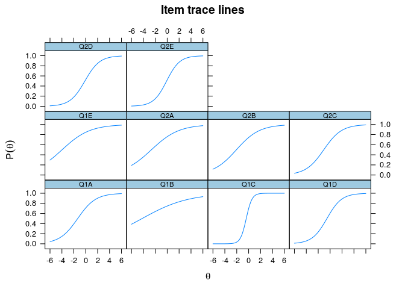<!-- -->

```r
plot(mirt.mtf, type = "infotrace")
```

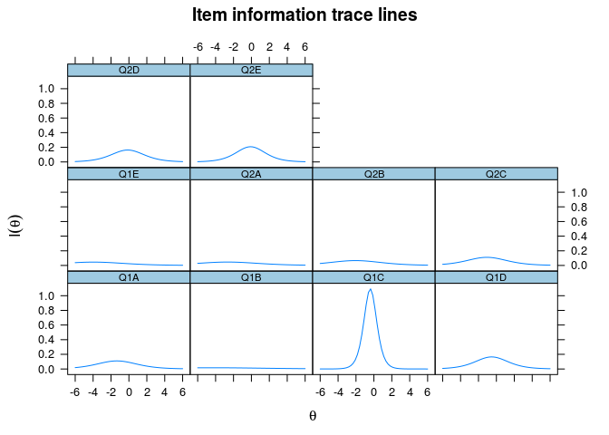<!-- -->

```r
plot(mirt.mtf, type = "info")
```

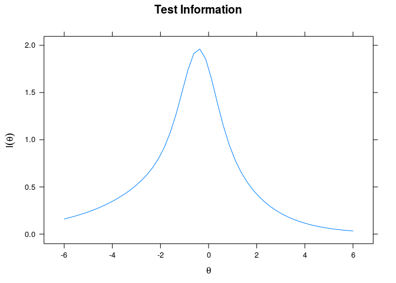<!-- -->

```r
plot(mirt.mtf, type = "infoSE")
```

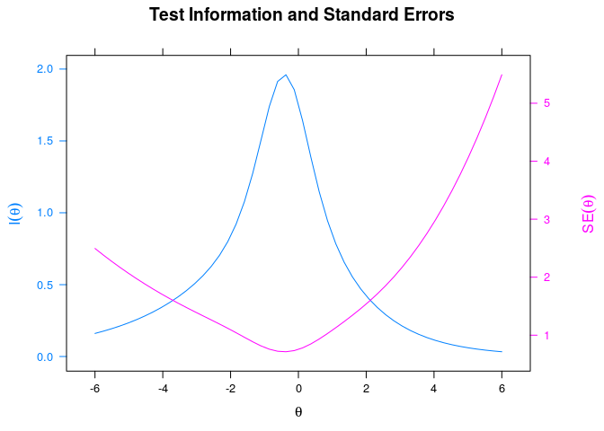<!-- -->

```r
plot(mirt.mtf)
```

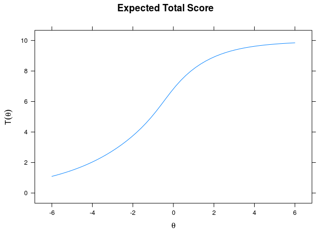<!-- -->

```r
# model fit
M2(mirt.mtf)  # M2 nsig.
```

```
##             M2 df         p      RMSEA RMSEA_5   RMSEA_95      SRMSR
## stats 45.27155 35 0.1145428 0.04296208       0 0.07530942 0.07488569
##             TLI       CFI
## stats 0.7982402 0.8430757
```

```r
itemfit(mirt.mtf)
```

```
##    item   S_X2 df.S_X2 p.S_X2
## 1   Q1A  1.353       5  0.929
## 2   Q1B  9.367       5  0.095
## 3   Q1C  0.132       3  0.988
## 4   Q1D  9.299       5  0.098
## 5   Q1E  3.241       4  0.518
## 6   Q2A 10.220       5  0.069
## 7   Q2B  1.231       5  0.942
## 8   Q2C  2.134       5  0.830
## 9   Q2D  6.402       5  0.269
## 10  Q2E  4.570       4  0.334
```

```r
personfit(mirt.mtf)
```

```
##              Zh
## 1   -0.59920953
## 2   -1.55278581
## 3    0.48361416
## 4   -0.28806330
## 5    0.86186607
## 6   -0.12945241
## 7    0.43249649
## 8   -0.21983954
## 9   -0.28447053
## 10   1.16550221
## 11   0.41626410
## 12   0.35450391
## 13   1.07463370
## 14   0.41054254
## 15   1.63477195
## 16   1.35254110
## 17   1.20135830
## 18   0.07666715
## 19  -0.15323259
## 20   0.06945484
## 21   1.06490231
## 22   0.05086960
## 23   0.64776424
## 24  -0.76909670
## 25  -0.23601304
## 26  -2.02591373
## 27  -0.34175787
## 28   0.14815545
## 29  -0.15091822
## 30   0.20695314
## 31   1.25676002
## 32   1.80902937
## 33   0.53015360
## 34   1.10417602
## 35   0.81470044
## 36   0.04837985
## 37   1.35254110
## 38  -0.28002229
## 39   0.39074013
## 40   1.25676002
## 41  -0.78175354
## 42   0.13335641
## 43   1.06490231
## 44   1.35254110
## 45   1.22027754
## 46   0.15455766
## 47   1.96074685
## 48   0.57072655
## 49  -0.07278620
## 50  -0.76577439
## 51  -1.82302879
## 52  -1.22236752
## 53   0.86186607
## 54  -1.52812052
## 55   1.35254110
## 56   1.35445353
## 57  -0.01659993
## 58   1.06490231
## 59   0.29636756
## 60   0.87044347
## 61   0.64776424
## 62   0.78414741
## 63   1.35254110
## 64  -1.49875377
## 65  -0.34604077
## 66   1.05858201
## 67   1.10994010
## 68   1.96074685
## 69  -0.15091822
## 70   1.25041255
## 71   0.86424000
## 72  -0.07278620
## 73   0.87044347
## 74  -0.79381635
## 75   0.57336889
## 76   1.35254110
## 77  -0.21477371
## 78  -0.12483915
## 79  -0.76909670
## 80  -0.05696428
## 81   0.81470044
## 82   0.13335641
## 83   1.38353967
## 84   0.62672420
## 85   0.67157818
## 86   0.67025597
## 87   0.62716282
## 88   0.64776424
## 89  -1.87225814
## 90  -0.21983954
## 91   0.84039329
## 92   1.35254110
## 93   0.20695314
## 94  -1.63070670
## 95   1.35254110
## 96   0.73355830
## 97   1.25676002
## 98   0.51453078
## 99   0.89232188
## 100  0.39954995
## 101  1.35254110
## 102 -1.50017716
## 103  0.38152393
## 104  0.54912052
## 105 -0.30169107
## 106 -0.57831523
## 107  0.47169486
## 108  0.41626410
## 109  0.82230273
## 110 -0.55239952
## 111  0.07850495
## 112  1.57198816
## 113  0.35450391
## 114 -0.16844663
## 115  1.06490231
## 116 -0.18877086
## 117  1.18950617
## 118  0.86186607
## 119  0.86186607
## 120  1.05858201
## 121  0.52909299
## 122  0.80017804
## 123 -0.64344399
## 124  0.29636756
## 125 -0.70571658
## 126  1.35254110
## 127  0.91572740
## 128 -0.26241847
## 129 -1.00637158
## 130  0.31503532
## 131 -0.79758405
## 132  0.33709094
## 133  0.13929727
## 134 -1.52812052
## 135  0.57072655
## 136 -1.52812052
## 137  0.86186607
## 138 -0.98137057
## 139  1.30235700
## 140 -0.06599807
## 141 -0.90361524
## 142 -2.67731095
## 143  0.28574583
## 144  0.02564499
## 145  1.35254110
## 146  0.62129773
## 147 -0.46778735
## 148  0.66826134
## 149 -1.01123703
## 150  0.07850495
## 151  0.82230273
## 152 -0.16561168
## 153 -0.23118694
## 154  1.35254110
## 155  1.96074685
## 156 -0.44042666
## 157  0.08194588
## 158 -1.80566517
## 159  1.65468756
## 160  1.11965959
```

```r
# reliabilities: marginal & empirical
marginal_rxx(mirt.mtf)  # 0.5574205
```

```
## [1] 0.5574205
```

```r
theta_se = fscores(mirt.mtf, full.scores.SE = T)
empirical_rxx(theta_se)  # 0.5681729
```

```
##        F1 
## 0.5681729
```
Refer "Item Response Theory approaches to test scoring and evaluating the score accuracy" by Anna Brown for explanations abour marginal and empirical reliabilities.

## References
1. Arifin, W. N., Yusoff, M. S. B. (in press). Item Response Theory for Medical Educationists. _Education in Medicine Journal_.
2. Baker, F. B. (2001). _The basics of item response theory_ (2nd ed). USA: ERIC Clearinghouse on Assessment and Evaluation. Retrieved from: http://echo.edres.org:8080/irt/baker/final.pdf
3. de Ayala, R. J. (2009). _The theory and practice of item response theory_. New York: The Guilford Press.
4. Hambleton, R.K. and Swaminathan, H. and Rogers, H.J. (1991). _Fundamentals of Item Response Theory_. California, USA: Sage Publications.
